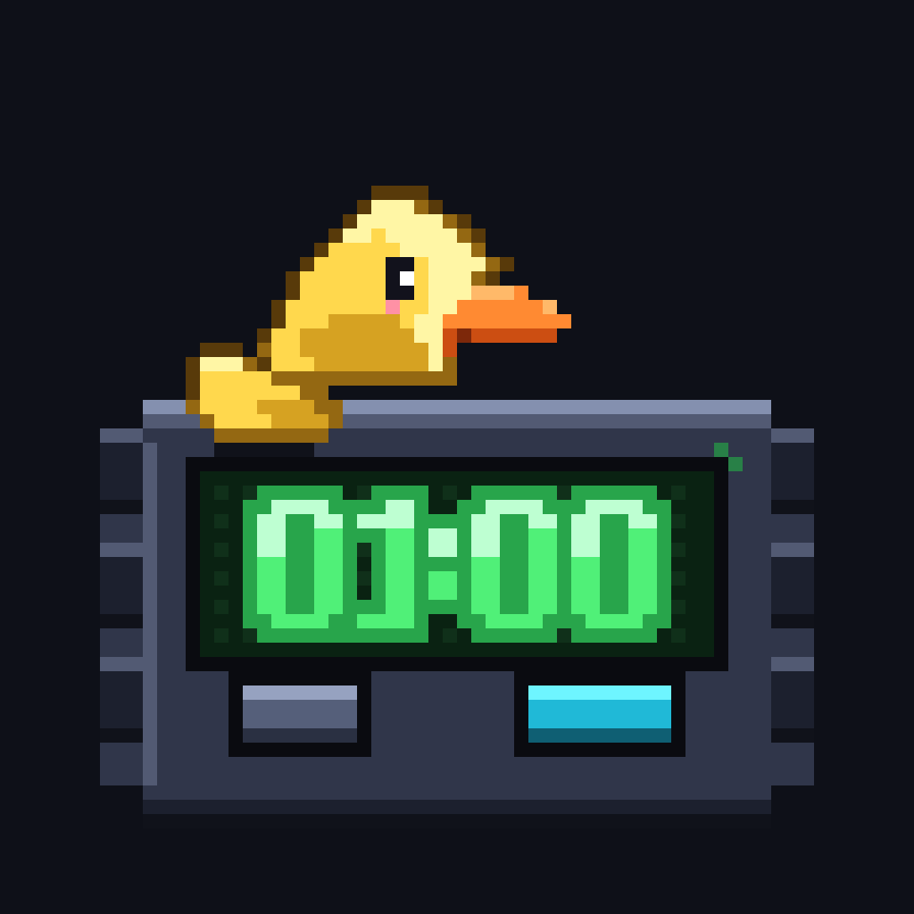
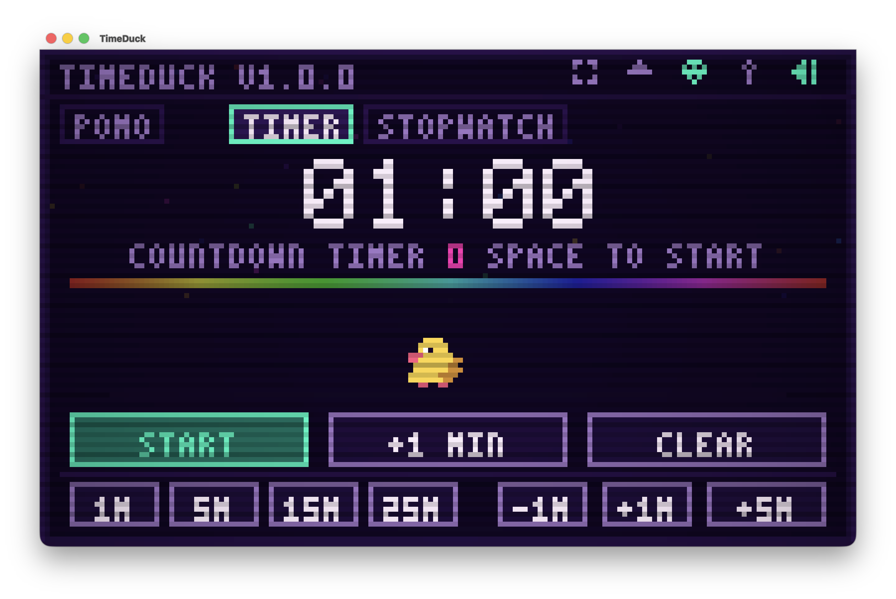
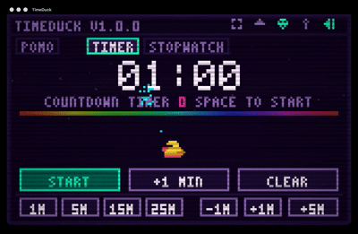
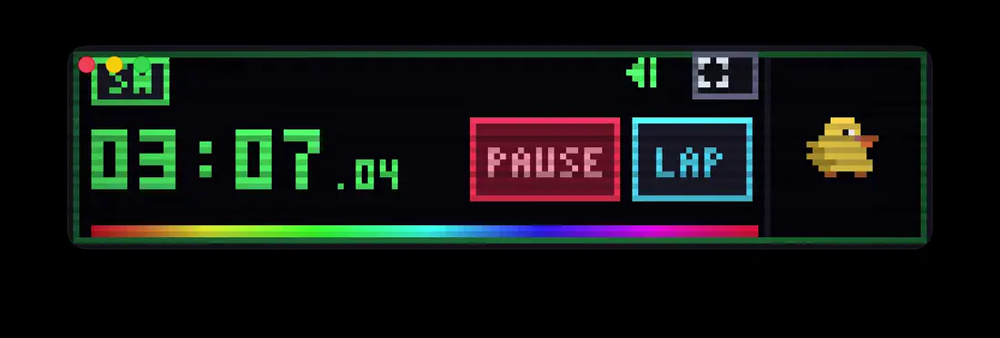
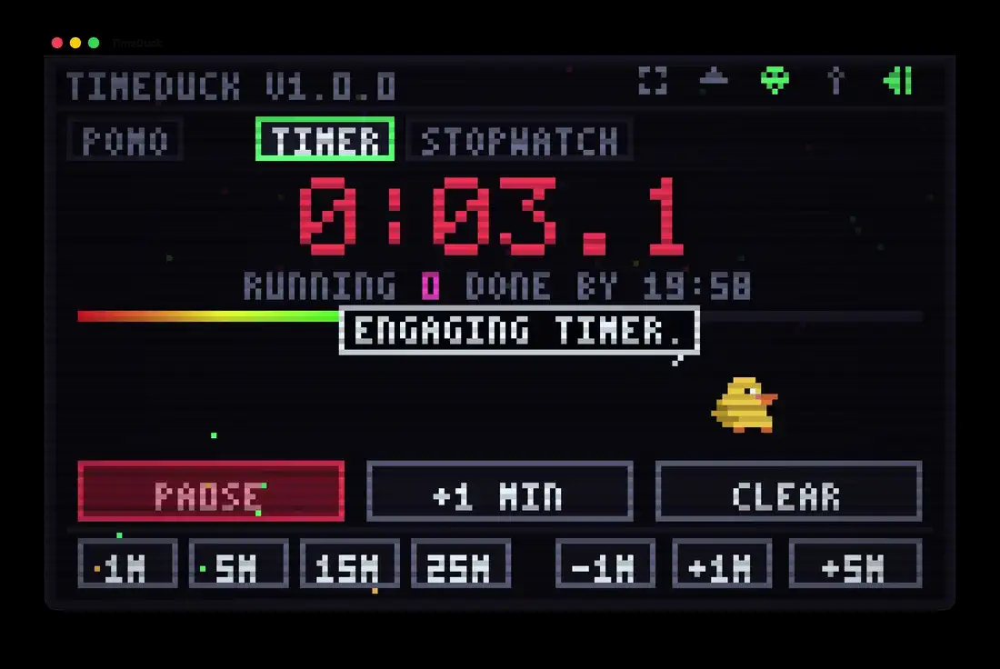
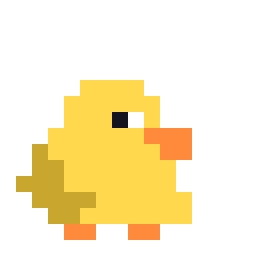
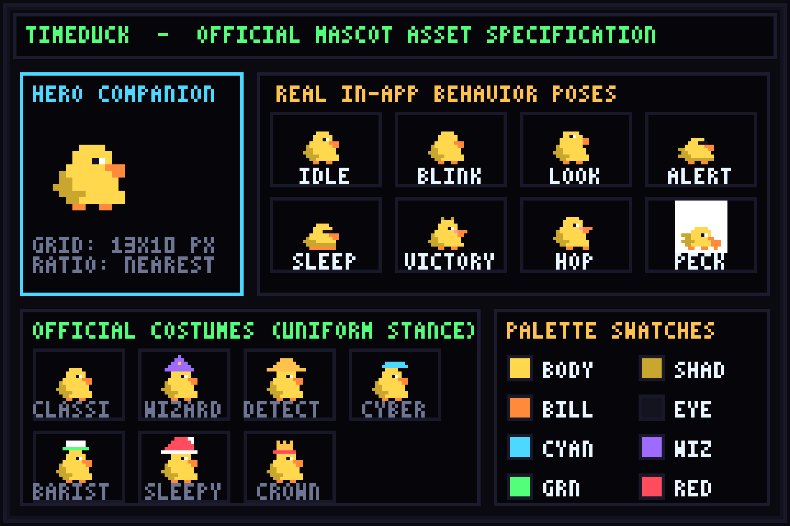
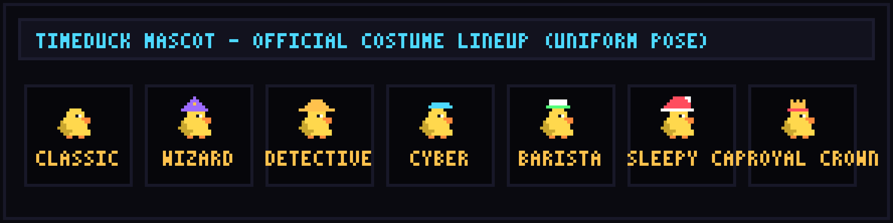
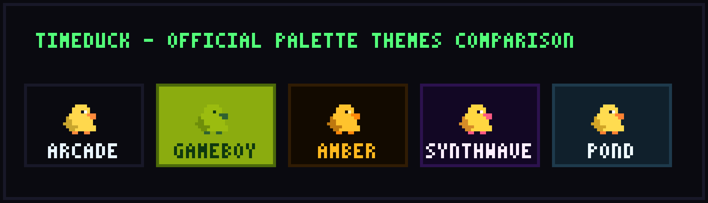
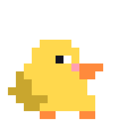

<p align="center">
  
</p>

<h1 align="center">TimeDuck</h1>

<p align="center">
  <strong>A lightweight native macOS timer, stopwatch, and Pomodoro focus companion with retro CRT aesthetics.</strong><br>
  Countdown · Pomodoro · Stopwatch · Menu Bar · Pixel-art Duck Companion · 100% Offline
</p>

<p align="center">
  
  
  
  
  
  
  
</p>

<p align="center">
  
</p>

<p align="center">
  
</p>

TimeDuck is a lightweight, open-source native macOS AppKit desktop timer and focus companion. It combines wall-clock-accurate countdown, stopwatch, and Pomodoro timing with an animated pixel duck who breathes, waddles, sleeps, eats breadcrumbs, and celebrates when your session is complete.

Zero external dependencies. Zero telemetry. No accounts, no cloud sync, and no background networking. Everything runs locally on your Mac with instant startup and state saved to a single local JSON file.

---

## Quick Install (Homebrew)

Install via Homebrew on Apple Silicon Macs:

```bash
brew install --cask VinceGuyMan/tap/timeduck
```

*Alternative two-step tap syntax:*
```bash
brew tap VinceGuyMan/tap
brew install --cask timeduck
```

> **Gatekeeper disclosure:** TimeDuck v1.0.0 is ad-hoc signed while establishing initial distribution. If macOS blocks first launch, click **Open Anyway** in *System Settings → Privacy & Security*, or run:
> ```bash
> xattr -d com.apple.quarantine /Applications/TimeDuck.app
> ```

---

## What you actually get

The screenshots below are captured directly from the shipping v1.0.0 release.

| Mode | What it does |
| --- | --- |
| **Countdown Timer** | Countdown from a default **01:00** with quick-set presets (**1M / 5M / 15M / 25M**) and fine adjustments (**-1M / +1M / +5M**). Tenths-of-a-second appear during the final 10 seconds. |
| **Pomodoro Focus** | Standard 25-minute work cycles (or custom focus lengths) with automated short/long break sequencing across a 4-cycle workflow. |
| **Stopwatch** | Wall-clock elapsed timing with split-time **LAP** recording, fastest/slowest lap highlighting, and clipboard summary export (<kbd>C</kbd>). |
| **Mini HUD** | Compact, always-handy floating strip (<kbd>M</kbd>) with live digits, pause/lap controls, progress meter, and companion duck. |
| **Menu Bar Companion** | Native macOS menu bar accessory (`LSUIElement`). Displays live countdown in the status bar, offers quick starts, and keeps timing active even when the main window is hidden. |

<p align="center">
  
</p>

When a countdown completes:

<p align="center">
  
</p>

---

## Companion Duck, Costumes & CRT Themes

<p align="center">
  
</p>

The duck is an animated desktop companion with dynamic behavioral states. Pet the duck with mouse clicks, drop breadcrumbs with <kbd>B</kbd>, or trigger celebratory hops with <kbd>Q</kbd>. Companion behavior reacts dynamically to your session: **Relaxed**, **Mission**, **Focus**, **Suspicious**, **Urgency**, **Victory**, **Break**, and **Sleepy**.

<p align="center">
  
</p>

TimeDuck features seven shipping costumes (<kbd>H</kbd>) and five retro CRT color palettes (<kbd>T</kbd>), rendered using crisp nearest-neighbor pixel graphics:

<p align="center">
  
</p>

<p align="center">
  
</p>

| Costumes (<kbd>H</kbd>) | Themes (<kbd>T</kbd>) |
| --- | --- |
| Classic Duck | Arcade Neon |
| Wizard Hat | Game Boy DMG |
| Detective Cap | Amber CRT |
| Cyber Shades | Synthwave |
| Barista | Duck Pond |
| Sleepy Cap | |
| Royal Crown | |

---

## Keyboard Shortcuts

| Key | Action |
| :---: | --- |
| <kbd>Space</kbd> | Start / pause (or advance a finished Pomodoro phase) |
| <kbd>Return</kbd> | Start / pause, or exit mini HUD mode |
| <kbd>L</kbd> | Record stopwatch lap, or skip current Pomodoro phase |
| <kbd>R</kbd> | Reset / clear current timer |
| <kbd>1</kbd> <kbd>2</kbd> <kbd>3</kbd> | Switch mode: Stopwatch (<kbd>1</kbd>) / Timer (<kbd>2</kbd>) / Pomodoro (<kbd>3</kbd>) |
| <kbd>H</kbd> | Cycle costume / hat |
| <kbd>T</kbd> | Cycle retro CRT theme |
| <kbd>M</kbd> | Toggle Mini HUD mode |
| <kbd>P</kbd> | Pin window always-on-top |
| <kbd>S</kbd> | Toggle sound effects |
| <kbd>Q</kbd> | Hop + quack companion trigger |
| <kbd>B</kbd> | Feed duck a breadcrumb |
| <kbd>C</kbd> | Copy today's focus stats & lap times to clipboard |
| <kbd>X</kbd> / <kbd>Cmd-Q</kbd> | Quit (state is saved automatically) |

---

## Building from Source

**Requirements:** macOS 12 Monterey or later, Xcode Command Line Tools.

```bash
# Build the release application bundle (build/TimeDuck.app)
./build.sh --release

# Run automated test suite
./build.sh --test

# Clean build artifacts
./build.sh --clean
```

Audio features an original looping 8-bit soundtrack (`Resources/Audio/TimeDuckTheme.m4a`) plus procedural audio synthesis for ticks, fanfares, quacks, and clicks. Music and sound effects can be toggled independently.

---

## Technical Architecture

Timing accuracy never relies on the UI display refresh loop. All remaining and elapsed durations are calculated from wall-clock timestamps (`Date`) against persistent reference anchors, ensuring that system sleep, window hiding, or background throttling cannot cause the clock to drift.

```
src/
├── App/        Window management, menu bar, persistence, hotkeys
├── Audio/      Theme playback + cached PCM audio synthesis
├── Engine/     Countdown, Pomodoro, Stopwatch, Duck Brain, Stats
├── Graphics/   Software pixel stage, CRT scanlines, sprites, palettes
└── Views/      Native AppKit host + pixel canvas renderer
```

- **Adaptive Refresh**: 60 FPS for active stopwatch/tenths, 30 FPS for countdowns, 15 FPS when idle, 10 FPS in background, 0 FPS when hidden.
- **State Storage**: Atomic, debounced JSON persistence at `~/Library/Application Support/TimeDuck/state.json`.
- **Zero Framework Overhead**: Handcrafted Swift and AppKit with zero external package dependencies.

---

## Privacy & Security

<p align="center">
  
</p>

TimeDuck is built with an offline-first philosophy:

- Zero network calls, zero sockets, zero analytics, zero crash reporters.
- No user accounts, no cloud dependencies, no machine identifiers.
- Open source under the [MIT License](LICENSE).

---

## Contributing & Project Scope

TimeDuck is intentionally designed as a focused, delightful desktop timer and companion instrument—not an enterprise productivity suite.

Please review [CONTRIBUTING.md](CONTRIBUTING.md) before opening pull requests. Our core design rule is keeping the application fast, lightweight, and offline. Any future additions must preserve TimeDuck's zero-telemetry privacy, native performance, and handcrafted pixel-art character.

---

<p align="center">
  
</p>

## License

[MIT License](LICENSE) © 2026 TimeDuck Contributors
