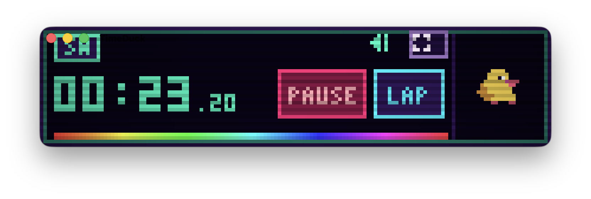
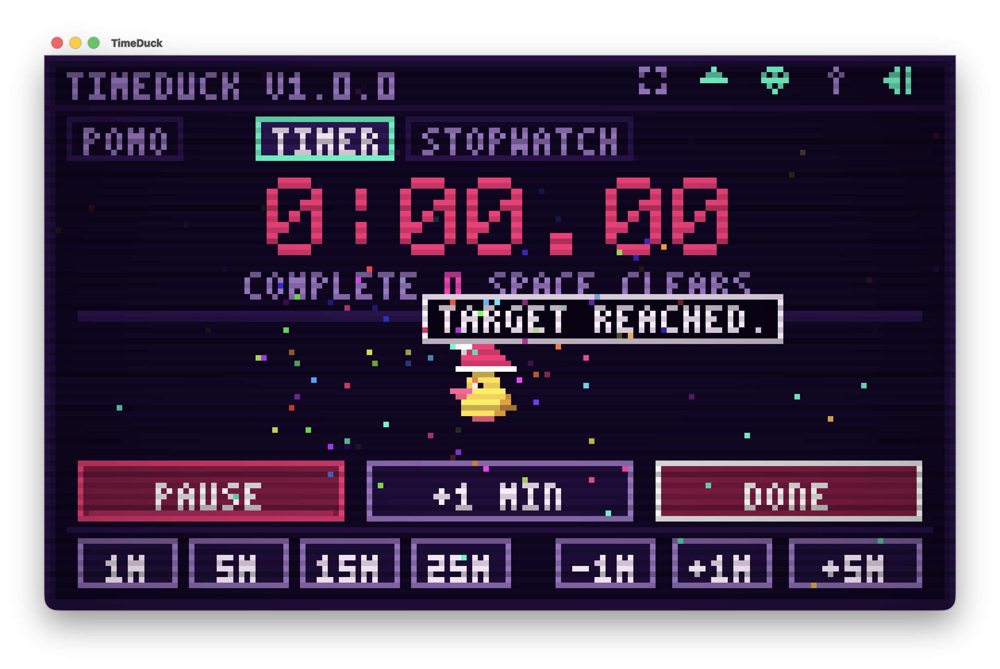

<p align="center">
  
</p>

<h1 align="center">TimeDuck</h1>

<p align="center">
  <strong>A native macOS pixel-duck companion and precision timing instrument.</strong><br>
  Countdown · Pomodoro · Stopwatch · CRT stage · original theme
</p>

<p align="center">
  
  
  
  
  
</p>

<p align="center">
  
</p>

<p align="center">
  
</p>

TimeDuck is a small AppKit app: a wall-clock-accurate timer that lives on the desktop with a duck who breathes, waddles, sleeps, eats breadcrumbs, and celebrates when the target hits zero.

No accounts. No network. No telemetry. One local `state.json`.

---

## What you actually get

The shots below are the shipping UI, not mockups.

| Mode | What it does |
| --- | --- |
| **Timer** | Countdown from a default **01:00**. Presets **1M / 5M / 15M / 25M**, then **-1M / +1M / +5M**. Tenths appear in the last 10 seconds. |
| **Pomodoro** | Focus → short break → long break on a 4-cycle. 25-minute standard or custom work length. |
| **Stopwatch** | Wall-clock elapsed time, **LAP** splits, fastest/slowest coloring, copy summary with `C`. |
| **Mini HUD** | Compact always-handy strip (`M`) with live digits, Pause / Lap, rainbow meter, and the duck. |
| **Menu bar** | Accessory app (`LSUIElement`). Live countdown in the menu bar, quick starts, hide the window without killing the clock. |

<p align="center">
  
</p>

When a countdown lands:

<p align="center">
  
</p>

---

## Duck, costumes, themes

<p align="center">
  
</p>

The duck is an animated desktop companion with real personality. Pet the duck, drop breadcrumbs with <kbd>B</kbd>, or trigger hops and quacks with <kbd>Q</kbd>. Behavior shifts dynamically with the clock: **Relaxed**, **Mission**, **Focus**, **Suspicious**, **Urgency**, **Victory**, **Break**, and **Sleepy**.

<p align="center">
  
</p>

Seven hats (<kbd>H</kbd>) and five CRT palettes (<kbd>T</kbd>), drawn as nearest-neighbor pixels — the exact same sprites rendered in the window.

<p align="center">
  
</p>

<p align="center">
  
</p>

| Costumes (<kbd>H</kbd>) | Themes (<kbd>T</kbd>) |
| --- | --- |
| Classic Duck | Arcade Neon |
| Wizard Hat | Game Boy DMG |
| Detective Cap | Amber CRT |
| Cyber Shades | Synthwave |
| Barista | Duck Pond |
| Sleepy Cap | |
| Royal Crown | |

---

## Keyboard

| Key | Action |
| :---: | --- |
| <kbd>Space</kbd> | Start / pause (or advance a finished Pomodoro) |
| <kbd>Return</kbd> | Start / pause, or leave mini mode |
| <kbd>L</kbd> | Stopwatch lap, or skip a Pomodoro phase |
| <kbd>R</kbd> | Reset / clear |
| <kbd>1</kbd> <kbd>2</kbd> <kbd>3</kbd> | Stopwatch / Timer / Pomodoro |
| <kbd>H</kbd> | Cycle costume |
| <kbd>T</kbd> | Cycle theme |
| <kbd>M</kbd> | Mini HUD |
| <kbd>P</kbd> | Pin always-on-top |
| <kbd>S</kbd> | Sound effects |
| <kbd>Q</kbd> | Hop + quack |
| <kbd>B</kbd> | Breadcrumb |
| <kbd>C</kbd> | Copy today's stats / laps |
| <kbd>X</kbd> / <kbd>Cmd-Q</kbd> | Quit (state is saved) |

---

## Run it

**Requirements:** macOS 12 Monterey or later. Prebuilt binary in this tree targets Apple Silicon; build from source on Intel.

```bash
./build.sh --app          # -> build/TimeDuck.app
./build.sh --release      # size-optimized bundle
./build.sh --test         # unit suite
./build.sh --clean
```

First launch on a fresh Mac: right-click the app then Open if Gatekeeper blocks the ad-hoc signature.

Audio: original looping TimeDuck Theme (`Resources/Audio/TimeDuckTheme.m4a`) plus procedural 8-bit clicks, urgency ticks, fanfare, and swept quacks. Music and SFX toggle independently.

---

## How it's built

Timing never comes from the frame pump. Remaining / elapsed time is always `Date` minus a wall-clock anchor, so sleep, hide, or a dropped frame cannot drift the clock.

```
src/
├── App/        window, menu bar, persistence, shortcuts
├── Audio/      theme playback + cached PCM synthesis
├── Engine/     timer / pomo / stopwatch, duck brain, stats
├── Graphics/   software pixel stage, CRT scanlines, sprites, themes
└── Views/      AppKit host + pixel renderer
```

Frame pump scales with what's on screen: 60 FPS for stopwatch / tenths / motion, 30 while a timer runs, 15 idle in front, 10 idle in back, 0 when hidden.

State lives at `~/Library/Application Support/TimeDuck/state.json` (atomic, debounced writes).

Principles worth keeping:

1. Wall-clock truth only.
2. One persistent `AVAudioEngine`, cached buffers.
3. Adaptive energy — do not paint what you cannot see.
4. Zero dependencies, zero network.

---

## Privacy

<p align="center">
  
</p>

TimeDuck is a local utility.

- No sockets, no analytics, no crash reporter
- No accounts, no cloud, no identifiers
- MIT licensed — see [LICENSE](LICENSE)

---

## Contributing

This is a timer with a duck, not a productivity suite. Read [CONTRIBUTING.md](CONTRIBUTING.md) before opening a PR. Out of scope: AI, accounts, sync, todos, calendars, gamification, telemetry, package bloat.

---

<p align="center">
  
</p>

## License

[MIT](LICENSE) © 2026 TimeDuck Contributors
