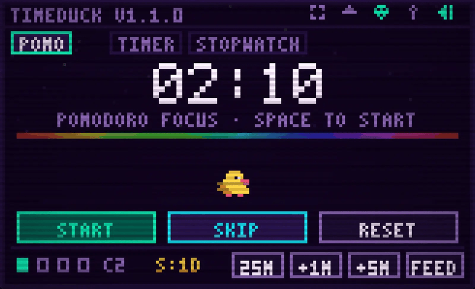
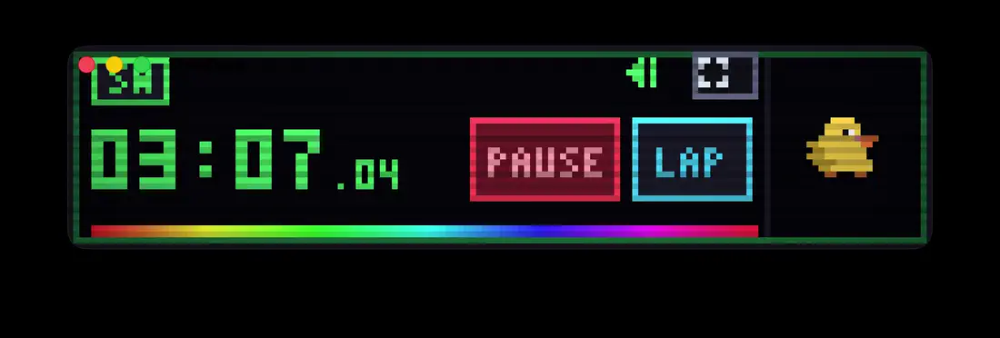
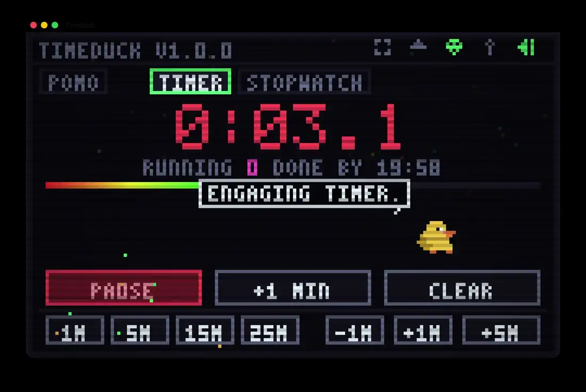
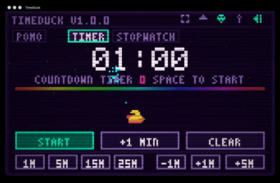

<div align="center">
  
  <h1>TimeDuck 1.2</h1>
  <p><strong>The Living Companion Update</strong></p>
  <p>Precision timer, Pomodoro focus tool, stopwatch, and a tiny pixel companion for macOS.</p>
  <p>
    <a href="https://github.com/VinceGuyMan/TimeDuck/releases/tag/v1.2.0"></a>
    
    
    
  </p>
</div>

> A focused desktop instrument with a living duck, handcrafted CRT graphics, wall-clock timing, and no accounts, telemetry, or cloud dependency.

## The big update

TimeDuck 1.2.0 gathers the unreleased DuckDrops work into one coherent release. Waves 2 through 8.2 now ship together as the **Living Companion Update**. The result is a deeper companion, a stronger pocket view, richer focus sessions, and a local protocol for timing AI work.

Wave 9 remains a separate design track for a possible clock replacement release. It is not part of 1.2.0.

<table>
<tr>
<td width="50%">
<h3>Living companion</h3>
<p>Reactive costumes, seasonal drops, secret moments, five companion characters, twenty achievements, Duckbook, and five procedural focus stories.</p>
</td>
<td width="50%">
<h3>Pocket Duck</h3>
<p>A protected MiniHUD, dedicated mini stage, clock scale handling, transition matrices, completion finales, and reduced-motion support.</p>
</td>
</tr>
<tr>
<td width="50%">
<h3>AI LiveSplit</h3>
<p>Loopback timing at <code>127.0.0.1:1834</code>, <code>timeduck://</code> controls, labeled laps, a terminal wrapper, and a passive Apple Silicon GPU watcher.</p>
</td>
<td width="50%">
<h3>Careful by default</h3>
<p>Offline-first operation, defensive state decoding, VoiceOver labels, safe-zone geometry, and the same timer math under every visual layer.</p>
</td>
</tr>
</table>

## A quick look

<p align="center">
  
</p>

<p align="center">
  
</p>

<p align="center">
  
</p>

More visual references live in the [GitHub asset catalog](docs/github/README.md), including the mascot, costumes, CRT themes, and animation loops.

## Install

### Homebrew

```bash
brew install --cask VinceGuyMan/tap/timeduck
```

### Build locally

Requires macOS 12 Monterey or later and the Xcode Command Line Tools.

```bash
./build.sh --release
open build/TimeDuck.app
```

The app is ad-hoc signed while distribution is being established. If macOS blocks the first launch, use **Open Anyway** in **System Settings → Privacy & Security**.

## What is in the instrument

| Mode | Details |
| --- | --- |
| Countdown | Wall-clock accurate presets, fine adjustments, final-ten-second tenths, and completion effects. |
| Pomodoro | Work and break sequencing with stories scoped to focus sessions. |
| Stopwatch | Labeled laps, fastest and slowest splits, and clipboard summaries. |
| MiniHUD | Compact floating view with live digits, pause/lap controls, progress, and a protected primary clock zone. |
| Menu bar | Native status item with quick starts and a live status readout while the main window is hidden. |
| Duckbook | Three-tab journal for companions, achievements, and secrets. |
| AI LiveSplit | Local HTTP and URL controls for prompts, tools, generation, and other timed stages. |

## Shortcuts

| Key | Action |
| :---: | --- |
| <kbd>Space</kbd> | Start or pause |
| <kbd>Return</kbd> | Start or pause, or leave MiniHUD |
| <kbd>L</kbd> | Record a stopwatch lap or skip a Pomodoro phase |
| <kbd>R</kbd> | Reset the active clock |
| <kbd>1</kbd> <kbd>2</kbd> <kbd>3</kbd> | Stopwatch, Timer, Pomodoro |
| <kbd>H</kbd> | Cycle costume |
| <kbd>T</kbd> | Cycle CRT theme |
| <kbd>M</kbd> | Toggle MiniHUD |
| <kbd>D</kbd> | Open Duckbook |
| <kbd>B</kbd> | Feed the duck |
| <kbd>Q</kbd> | Companion hop and quack |
| <kbd>C</kbd> | Copy focus stats and laps |
| <kbd>X</kbd> / <kbd>Cmd-Q</kbd> | Quit and save |

## Release evidence

The v1.2.0 release was built from the merged GitHub baseline and the DuckDrops candidate tree.

```text
./build.sh --test     262 passed, 0 failed
./build.sh --release  release app bundle created
```

The test suite covers the timer engines, persistence, accessibility and motion behavior, every consolidated wave, the AI LiveSplit protocol, GPU monitoring, and the What's New announcement.

## Privacy and architecture

TimeDuck has no accounts, analytics, cloud sync, or remote service. The AI controls are loopback-only and opt-in. State is saved atomically in:

```text
~/Library/Application Support/TimeDuck/state.json
```

The app is handcrafted Swift and AppKit with no external package dependencies. Timer truth lives in wall-clock timestamps; the animation layer never becomes the clock.

## Project map

- [`CHANGELOG.md`](CHANGELOG.md) — public release history, beginning with v1.2.0.
- [`RELEASE-MAP.md`](RELEASE-MAP.md) — canonical wave-to-release map.
- [`TimeDuck-Releases/v1.2-Living-Companion/RELEASE.md`](TimeDuck-Releases/v1.2-Living-Companion/RELEASE.md) — full consolidated release notes and scope boundary.
- [`docs/WAVE_9_HANDOFF.md`](docs/WAVE_9_HANDOFF.md) — future clock-replacement proposal held outside v1.2.0.
- [`CONTRIBUTING.md`](CONTRIBUTING.md) — contribution guidance.

## License

[MIT License](LICENSE) © 2026 TimeDuck Contributors
