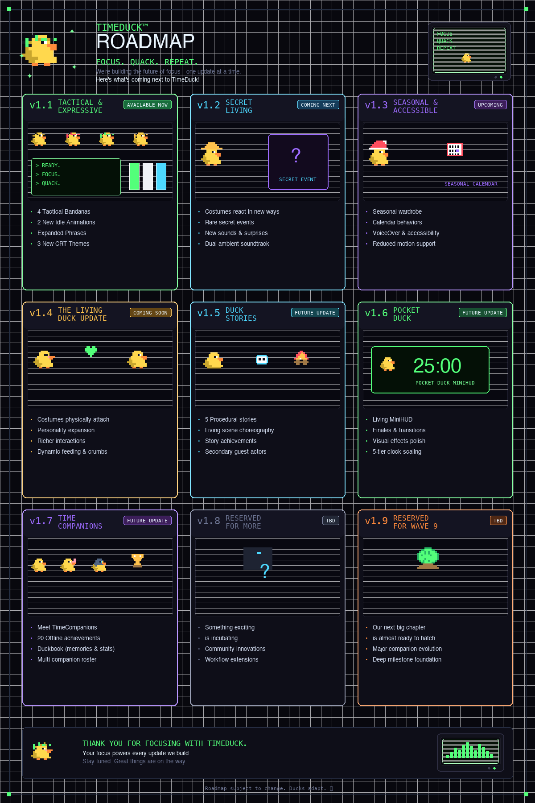

# TimeDuck Roadmap & Update Plan

Welcome to the public development roadmap for **TimeDuck**, the living pixel duck desktop companion and precision focus instrument for macOS.

This roadmap outlines where TimeDuck has been, what is available now, and where future updates are headed.

  

---

## Release Schedule & Overview

| Version | Codename | Status | Highlights |
| :--- | :--- | :--- | :--- |
| **v1.0** | *The Living Instrument* | **Released** | Core Pomodoro, Countdown Timer, Stopwatch, 5 CRT Palettes, 7 Costumes, Procedural Audio |
| **v1.1** | *Tactical & Expressive* | **Available Now** | 4 Tactical Bandanas, Feather Ruffle & Curious Peek, 3 New CRT Themes, What's New Popup, Show TimeDuck |
| **v1.2** | *Secret Living* | **Coming Next** | Reactive Costumes, Rare Secret Events, Expanded Soundtrack & Secrets |
| **v1.3** | *Seasonal & Accessible* | Planned | Seasonal Wardrobe, Offline Holiday Calendar, Accessibility Enhancements |
| **v1.4** | *The Living Duck Update* | Planned | Physical Costume Anchoring, Living Duck AI, Dynamic Breadcrumbs & Feeding Reactions |
| **v1.5** | *Duck Stories* | Planned | Procedural Story Engine, Multi-Phase Story Scenes, Story Achievements |
| **v1.6** | *Pocket Duck* | Planned | Living MiniHUD, Story Finales, Visual Polish & Transitions |
| **v1.7** | *TimeCompanions* | Planned | TimeCompanions, Duckbook Roster, Milestones & Collector Badges |
| **v1.8** | *Reserved* | TBD | Reserved for community-driven desktop companion innovations |
| **v1.9** | *Reserved* | TBD | Reserved for long-term companion evolutions |

---

## Detailed Version Breakdown

### [v1.1] — Tactical & Expressive
**Status**: **Released / Available Now**

- **4 Tactical Bandanas**: Midnight Operative, Crimson Ronin, Forest Camo, and Desert Camo headwear with fluttering trailing ties.
- **Richer Idle Life**: Multi-frame Feather Ruffle wing shake and Curious Peek inquisitive head tilt.
- **3 New CRT Themes**: Terminal Green (VT220 phosphor), Paperwhite (e-ink glare-free grayscale), and Electric Pond (high-voltage neon navy & cyan).
- **Expanded Situational Phrase Engine**: 20+ new context-aware quips with anti-repetition memory.
- **What's New / What's Next Experience**: Automatic one-time-per-version release announcement and next-version preview.
- **Menu Bar Show TimeDuck**: Instantly restore, unminimize, and bring the existing TimeDuck window to the front without interrupting active countdowns.

---

### [v1.2] — Secret Living
**Status**: **Coming Next**

- **Reactive Costumes**: Costumes gain subtle context-aware reactions and micro-behaviors during focus sessions.
- **Rare Secret Events**: Rare, delightful Easter egg moments to discover during extended resting and focus sessions.
- **Atmospheric Audio Expansion**: Multi-track background music and enhanced procedural 8-bit sound design.

---

### [v1.3] — Seasonal & Accessible
**Status**: **Planned**

- **Seasonal Wardrobe**: Event-based and holiday costumes (Autumn, Halloween, Winter, Festive).
- **Offline Seasonal Calendar**: Duck dynamically acknowledges calendar events and changing seasons without requiring network access.
- **Enhanced Accessibility**: High-contrast display options, reduced motion modes, and expanded screen reader integration.

---

### [v1.4] — The Living Duck Update
**Status**: **Planned**

- **Physical Costume Anchoring**: Dynamic anatomical alignment and secondary physics for accessories and hats.
- **Living Duck Behaviors**: Feeding interactions, breadcrumb physics, temporary chonky state, and expressive mood transitions.
- **Pond Ecosystem**: Ambient interactive environment elements that respond to user productivity and streaks.

---

### [v1.5] — Duck Stories
**Status**: **Planned**

- **Procedural Story Engine**: Multi-session episodic mini-narratives triggered by focus milestones.
- **Living Choreography**: Animated vignettes and special guest companions visiting the pond.
- **Story Archive**: Track and revisit completed narrative journeys.

---

### [v1.6] — Pocket Duck
**Status**: **Planned**

- **Living MiniHUD**: Richer micro-animations, quick actions, and visual indicators tailored for ultra-compact screen spaces.
- **Story Finales**: Climax chapters and celebratory rewards for completed focus arcs.
- **Pixel Polish & Transitions**: Enhanced phosphor CRT bloom, CRT curvature adjustments, and fluid window resizing.

---

### [v1.7] — TimeCompanions
**Status**: **Planned**

- **TimeCompanions**: Unlockable companion roster with unique personalities, phrases, and visual designs.
- **Duckbook**: In-app companion almanac, stats breakdown, and personal milestone ledger.
- **Focus Achievements**: Offline badges and rewards for dedication, streak milestones, and session goals.

---

### [v1.8] & [v1.9] — Reserved
**Status**: **TBD / Reserved**

- Reserved for future companion evolutions and community requests.

---

## Development Philosophy & Guiding Principles

1. **100% Offline & Private**: Zero telemetry, zero external network calls, zero data harvesting. All statistics, settings, and companion states remain strictly on your Mac.
2. **Zero Resource Waste**: Ultra-lightweight native Swift & AppKit software rasterizer with adaptive frame pumping (0–60 FPS) to ensure near-zero CPU/GPU utilization during background and idle states.
3. **Precision First**: Clean separation between mathematical timer state and pixel presentation so the countdown engine never misses a millisecond.

*Disclaimer: Roadmap subject to change as TimeDuck evolves.*
