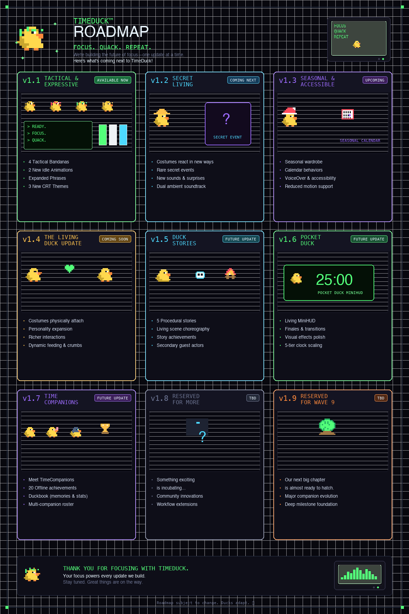

# TimeDuck Roadmap

TimeDuck is a native macOS timer and living pixel companion. The public release map is maintained in [`RELEASE-MAP.md`](RELEASE-MAP.md).

  

## Current release

### v1.2.0 — The Living Companion Update

**Status: Published.** Waves 2 through 8.2 are consolidated in one release:

- reactive costumes, seasonal drops, accessibility, and reduced-motion behavior;
- living duck interactions, feeding, Chonky mode, and expanded phrases;
- five procedural focus stories, living scenes, MiniHUD geometry, transitions, and finales;
- TimeCompanions, achievements, Duckbook, and CRT unlock toasts;
- AI LiveSplit controls, labeled laps, terminal wrappers, and passive GPU timing.

See the [full release notes](TimeDuck-Releases/v1.2-Living-Companion/RELEASE.md).

## Next design track

### Wave 9 — Clockwork Pond

**Status: Held outside v1.2.0.** [`docs/WAVE_9_HANDOFF.md`](docs/WAVE_9_HANDOFF.md) contains a proposal for a world clock, scheduled alarms, a digital menu-bar clock mode, and ambient chimes. Those systems have no implementation claim in the current release and need a separate scope decision.

## Principles

1. **Precision first:** wall-clock timestamps remain the source of truth.
2. **Duck as presentation:** stories, costumes, audio, and effects never own timer state.
3. **Offline by default:** no accounts, telemetry, cloud sync, or remote service.
4. **Small public promises:** release notes, tags, roadmap, and source status stay aligned.
